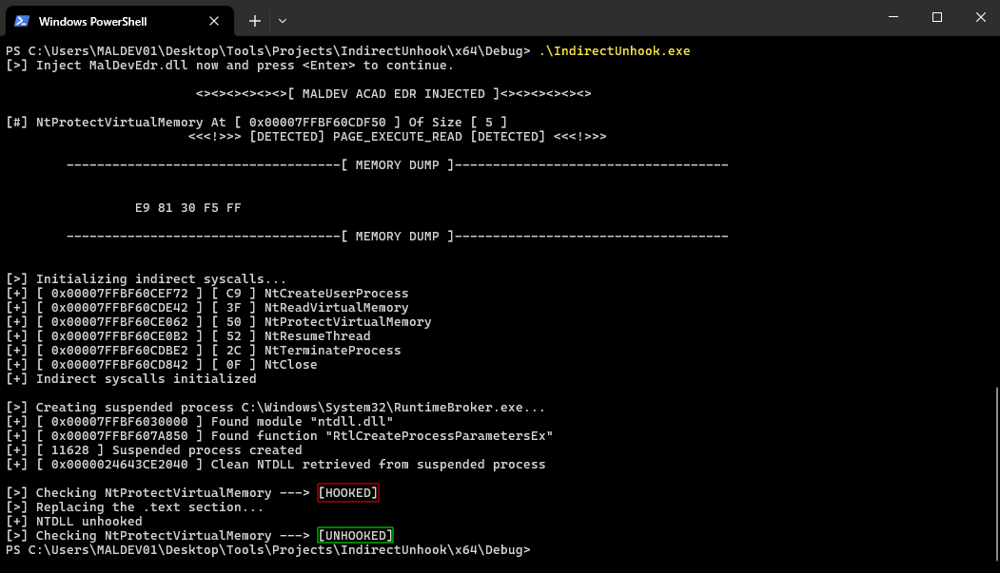

# IndirectUnhook

NTDLL Unhooking via retrieving a clean version of `ntdll.dll` from a suspended process, utilizing indirect syscalls using the HellsHall technique.

## Features

- NTDLL Unhooking from suspended process
- Full implementation using indirect syscalls with HellsHall
- Process creation using NtCreateUserProcess
- API Hashing

## Screenshots

Testing with hooked NtProtectVirtualMemory function:

